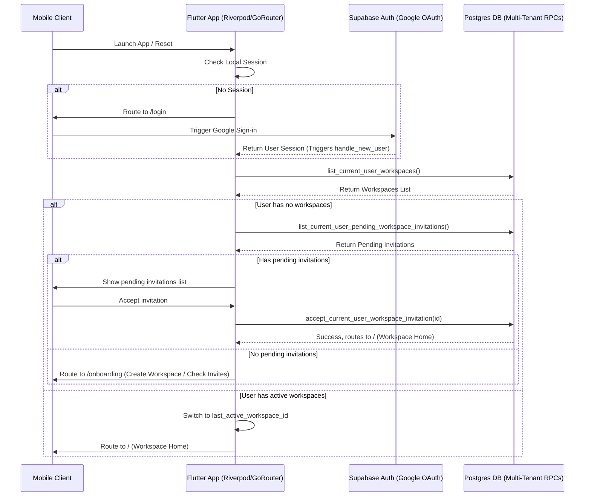

# Authentication & Workspace Onboarding Architecture - Kapında Hub

This document defines the authentication architecture, workspace onboarding layers, and user state checks implemented in the Kapında Hub platform.

---

## 1. Authentication and Workspace Access Flow Diagram

---

## 2. Decoupled Global User Signup & Profile Sync

The platform uses a decoupled sign-up model to support multi-tenant workspace onboarding:
1. **Global Account Creation**: Users can sign up freely using Google OAuth. Sign-up is not blocked by a global allowlist.
2. **Idempotent Profile Trigger**: Upon successful authentication, a database trigger `tr_on_auth_user_created` runs `handle_new_user()` which creates a global `profiles` record:
   - Sets the user's display name, email, and avatar.
   - Assigns a default legacy role `'intern'` with zero initial workspace permissions.
   - User is **not** automatically added to any workspace membership during signup.
3. **Workspace invitations**: Users receive invitations via email. A user can accept invitations post-signup to join their target workspaces.

---

## 3. Client-Side GoRouter Redirect Guards

The application leverages `go_router` redirect guards to enforce state-based routing:

- **Unauthenticated Redirect**: Redirects to `/login` if `Supabase.instance.client.auth.currentSession` is null.
- **Onboarding Guard**: Gated by checking if `list_current_user_workspaces()` returns an empty list. Redirects to workspace onboarding screens (`/onboarding`).
- **Workspace Switcher Guard**: Allows switching between multiple active workspaces dynamically via `set_current_user_active_workspace()`.
- **Biometric Guard**: Gated by checking if the inactivity timer (15 minutes) is exceeded. Redirects to `/biometric-lock`.
- **MFA Admin Guard**: Gated by role-based MFA requirements configured in `workspace_settings` (e.g., `require_mfa_for_owner`, `require_mfa_for_admin`). Redirects to `/mfa` verification if the session AAL is insufficient.
