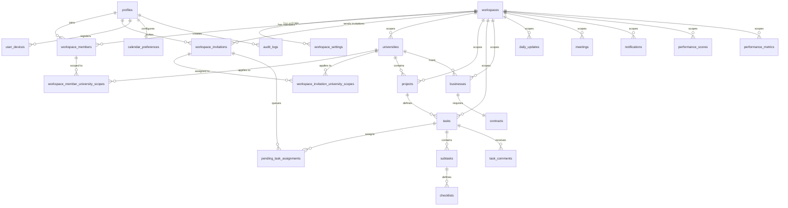

# Database Plan & Schema Design - Kampüs Hub

> [!NOTE]
> **Schema Status**: All multi-tenant core structures and Row-Level Security policies up to migration `20260712060000_fix_invitation_task_assignment_resolution.sql` have been successfully deployed and verified with zero errors.

---

This document defines the PostgreSQL database schema for Kampüs Hub, implemented via Supabase migrations. It outlines custom data types, table structures, Row-Level Security (RLS) rules, soft-delete policies, multi-tenant workspace isolation, and the ER diagram.

---

## 1. Custom Types (Enums)

We define the following PostgreSQL custom types to enforce integrity:

- `workspace_permission_role`: `'owner'`, `'admin'`, `'manager'`, `'member'`, `'guest'`
- `workspace_job_role`: `'operations'`, `'marketing'`, `'social_media'`, `'video_editor'`, `'software'`, `'university_representative'`, `'courier_operations'`, `'custom'`
- `workspace_membership_status`: `'invited'`, `'active'`, `'suspended'`, `'expired'`, `'left'`
- `workspace_invitation_status`: `'pending'`, `'accepted'`, `'declined'`, `'expired'`, `'revoked'`
- `task_priority`: `'low'`, `'normal'`, `'high'`, `'critical'`
- `task_status`: `'planned'`, `'todo'`, `'in_progress'`, `'waiting'`, `'review'`, `'revision_required'`, `'completed'`, `'cancelled'`
- `business_stage`: `'discovered'`, `'visit_planned'`, `'contact_identified'`, `'contacted'`, `'meeting_scheduled'`, `'meeting_completed'`, `'follow_up'`, `'integration_discussion'`, `'agreement_reached'`, `'contract_completed'`, `'menu_transfer'`, `'system_installation'`, `'whatsapp_group'`, `'advertising_planning'`, `'activated'`, `'advertising_published'`, `'active'`, `'rejected'`, `'paused'`
- `performance_period`: `'weekly'`, `'monthly'`, `'quarterly'`, `'semiannual'`, `'annual'`
- `request_status`: `'pending'`, `'approved'`, `'rejected'`

---

## 2. Table Definitions

### 2.1 Multi-Tenant Core Structures
- **`workspaces`**: Core tenant table.
  - `id` (uuid, PK)
  - `name` (text, not empty)
  - `slug` (text, unique, alphanumeric/hyphens)
  - `industry` (text)
  - `logo_url` (text)
  - `default_language` (text) - default `'tr'`
  - `timezone` (text) - default `'Europe/Istanbul'`
  - `is_active` (boolean)
  - `created_by` (uuid)
  - `created_at`, `updated_at`, `deleted_at` (timestamptz)
- **`workspace_settings`**: Workspace configurations.
  - `id` (uuid, PK)
  - `workspace_id` (uuid, FK references workspaces, unique)
  - `require_mfa_for_owner`, `require_mfa_for_admin`, `require_mfa_for_manager` (boolean)
  - `daily_update_required` (boolean)
  - `daily_update_deadline` (time)
  - `quiet_hours_start`, `quiet_hours_end` (time)
  - `created_at`, `updated_at` (timestamptz)
- **`workspace_members`**: Bridges users and workspaces.
  - `id` (uuid, PK)
  - `workspace_id` (uuid, FK references workspaces)
  - `user_id` (uuid, FK references profiles)
  - `permission_role` (workspace_permission_role)
  - `job_role` (workspace_job_role)
  - `custom_job_role` (text)
  - `department` (text)
  - `membership_status` (workspace_membership_status)
  - `access_expires_at` (timestamptz)
  - `joined_at` (timestamptz)
  - `invited_by` (uuid, FK references profiles)
  - `created_at`, `updated_at`, `deleted_at` (timestamptz)
- **`workspace_member_university_scopes`**: Many-to-many university scopes per member.
  - `id` (uuid, PK)
  - `workspace_member_id` (uuid, FK references workspace_members)
  - `university_id` (uuid, FK references universities)
  - `created_by` (uuid, FK references profiles)
  - `created_at` (timestamptz)
- **`workspace_invitations`**: Invitations for workspace membership.
  - `id` (uuid, PK)
  - `workspace_id` (uuid, FK references workspaces)
  - `normalized_email` (text) - lower, trimmed
  - `token_hash` (text, unique)
  - `permission_role` (workspace_permission_role)
  - `job_role` (workspace_job_role)
  - `custom_job_role` (text)
  - `department` (text)
  - `invited_by` (uuid, FK references profiles)
  - `invitation_status` (workspace_invitation_status)
  - `expires_at`, `accepted_at`, `declined_at`, `access_expires_at` (timestamptz)
  - `created_at`, `updated_at` (timestamptz)
- **`workspace_invitation_university_scopes`**: Pre-assigned university scopes for invitations.
  - `id` (uuid, PK)
  - `workspace_invitation_id` (uuid, FK references workspace_invitations)
  - `university_id` (uuid, FK references universities)
  - `created_at` (timestamptz)
- **`pending_task_assignments`**: Assignment queue for users pending registration.
  - `id` (uuid, PK)
  - `workspace_id` (uuid, FK references workspaces)
  - `workspace_invitation_id` (uuid, FK references workspace_invitations)
  - `task_id` (uuid, FK references tasks)
  - `normalized_email` (text)
  - `assignment_role` (text)
  - `idempotency_key` (text, unique)
  - `assigned_by` (uuid, FK references profiles)
  - `resolved_user_id` (uuid, FK references profiles)
  - `resolved_at` (timestamptz)
  - `created_at` (timestamptz)

### 2.2 Profiles & Devices
- **`profiles`**: User metadata, linked 1:1 to Supabase `auth.users`.
  - `id` (uuid, PK, references auth.users)
  - `email` (text, unique)
  - `role` (user_role, **deprecated**)
  - `full_name` (text)
  - `avatar_url` (text)
  - `university_id` (uuid, FK references universities, **deprecated**)
  - `last_active_workspace_id` (uuid, FK references workspaces)
  - `created_at`, `updated_at` (timestamptz)
- **`user_devices`**: Tracks active devices for 2-device limit enforcement.
  - `id` (uuid, PK)
  - `user_id` (uuid, FK references profiles)
  - `device_identifier_hash` (text, unique)
  - `device_name` (text)
  - `platform` (text)
  - `app_version` (text)
  - `first_seen_at` (timestamptz)
  - `last_seen_at` (timestamptz)
  - `is_active` (boolean)
  - `revoked_at` (timestamptz)
  - `push_token` (text)

### 2.3 Scoped Tenant Tables
All tables below are isolated via a mandatory `workspace_id UUID NOT NULL REFERENCES workspaces(id)` column:

- **`universities`**
- **`projects`**
- **`tasks`** (Includes UNIQUE compound key `(id, workspace_id)`)
- **`businesses`**
- **`contracts`**
- **`daily_updates`**
- **`meetings`**
- **`notifications`**
- **`performance_scores`**
- **`performance_metrics`**

---

## 3. Entity-Relationship (ER) Diagram



---

## 4. Row-Level Security (RLS) Matrix

Supabase RLS is enabled on all tenant-specific tables.

### Tenant Isolation Check
For any request on a workspace-scoped table, the database checks workspace membership:
```sql
CREATE OR REPLACE FUNCTION public.is_workspace_member(p_workspace_id UUID, p_user_id UUID)
RETURNS BOOLEAN AS $$
BEGIN
    RETURN EXISTS (
        SELECT 1 FROM public.workspace_members
        WHERE workspace_id = p_workspace_id 
          AND user_id = p_user_id 
          AND membership_status = 'active'
          AND is_active = true
          AND (access_expires_at IS NULL OR access_expires_at > now())
    );
END;
$$ LANGUAGE plpgsql SECURITY DEFINER;
```

### Authorization Matrix

| Table Name | RLS Scope Rule |
| :--- | :--- |
| `workspaces` | User must be an active member of the workspace. |
| `workspace_members` | Member of the same workspace can read; Only `owner` and `admin` can mutate. |
| `workspace_settings` | Only `owner` and `admin` can read/mutate. |
| `workspace_invitations` | Only `owner` and `admin` can read/mutate; User can read self invitations. |
| `universities` / `projects` / `tasks` | Active workspace members. `university_representative` role filtered via `workspace_member_university_scopes`. |
| `businesses` / `contracts` | Active workspace members. Representative role blocked. Contracts are Admin-only. |
| `daily_updates` / `meetings` | Active workspace members. |
| `notifications` | Isolated by `user_id = auth.uid()` and `workspace_id`. |
| `audit_logs` | Admin-only access. |
