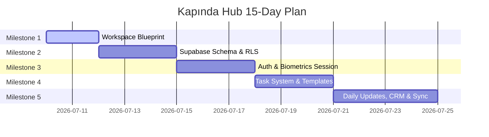

# 15-Day Milestone & Development Plan - Kapında Hub

This document defines the 15-day development plan for Kapında Hub, broken down into progressive milestones. It outlines daily tasks, deliverables, and test criteria.

---

## 15-Day Timeline

---

## Milestone Breakdown

### Milestone 1: Workspace & Structural Design (Days 1 - 2)
*This is the current milestone.*
- **Daily Tasks:**
  - Create directory structures for docs, source code outlines, and Supabase config.
  - Establish `README.md`, `WORKLOG.md`, `.env.example`.
  - Design ER schema and document RLS constraints.
  - Detail Flutter route definitions and navigation guards.
- **Deliverables:** Architectural documents and workspace settings.
- **Verification:** Markdown lint validation and path consistency check.

### Milestone 2: Database Migration & RLS Deployment (Days 3 - 5)
- **Daily Tasks:**
  - Setup local Supabase environment (Docker config).
  - Write SQL migrations for all custom types (user roles, task status, etc.).
  - Create tables with soft-delete columns (`deleted_at`) and trigger scripts.
  - Write Row-Level Security (RLS) policies for all 17+ tables.
  - Deploy migrations to local Supabase instance.
- **Deliverables:** SQL migration scripts and local DB instance running.
- **Verification:** Run test scripts querying tables under different roles (Admin, Normal, Uni Rep) to verify RLS blocks/allows correctly.

### Milestone 3: Authentication & Device Authorization (Days 6 - 8)
- **Daily Tasks:**
  - Configure Google Sign-in plugin inside Flutter.
  - Implement access allowlist validation trigger in Supabase (on auth hook).
  - Build Device Tracker logic restricting accounts to max 2 active sessions.
  - Integrate native biometrics (`local_auth` package) for subsequent logins.
  - Build inactivity timer (15 minutes) forcing lock screen.
- **Deliverables:** Working Google Sign-in flow and session security locks.
- **Verification:** Test log-in on three separate devices/simulators to ensure third device is rejected, and verify app locks after 15 mins.

### Milestone 4: Task Management & Automations (Days 9 - 11)
- **Daily Tasks:**
  - Build task database APIs and CRUD views (Kanban & list layouts).
  - Implement task status flows and waiting state reason requirement.
  - Create Supabase triggers to auto-generate the 24-step "University Opening Task Template" when a new university record is inserted.
  - Code task notification scheduler adhering to quiet hours rules (23:00 - 08:00).
- **Deliverables:** Complete task flow screens and automated templates.
- **Verification:** Insert a university and assert 24 tasks are generated. Verify task state changes and quiet-hour notification logs.

### Milestone 5: Daily Updates, Google Calendar & CRM (Days 12 - 15)
- **Daily Tasks:**
  - Build Daily Update editor screen with local draft autosave and draft versioning tables.
  - Write cron functions for update warnings (20:00) and late update flags.
  - Connect Google Calendar API to manage user busy/free availability.
  - Design CRM staging pipeline and lock contracts view behind Admin roles.
  - Setup raw performance metric collectors.
- **Deliverables:** Integrated updates, calendar slots, CRM staging dashboard.
- **Verification:** Run project compilation checks, execute integration tests, and finalize app readiness for pilot.

---

## Next Milestone Proposal (Milestone 2)

**Proposal:** Start **Milestone 2 (Supabase Migration & RLS Deployment)**.
- **Goal:** Set up local docker environment for Supabase development, write all table migrations, configure triggers for audit logging, and implement row-level security (RLS) policies.
- **Estimated Duration:** 3 Days.
